# PR #49｜圖文密度修正與 G4 驗證記錄

比較基準：Commit 39271f7。範圍：P15、P21、P22、P41、P45–46、P48、P52、P91、P93、P95。

**頁數可依教學需要增減。** P2 Outline 為新增 A01，沒有取代原 rev11 的任何頁面；原 82 頁保留。這輪 P22 與 P23 可分工，P41 使用三步操作，P91 放行前後的說明其他頁已教，暫時維持 107 頁。若一張頁面有兩項無法清楚共存的教學任務，允許增頁，毋須維持固定張數。

## 主要修改及圖像

| 頁面 | 修正前 | 修正後 | 學員此頁應看懂 |
|---|---|---|---|
| P22 | 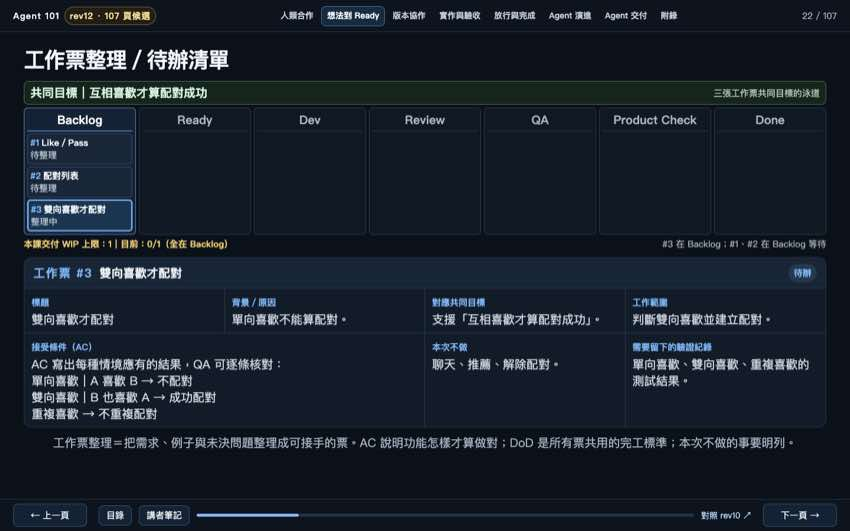 | 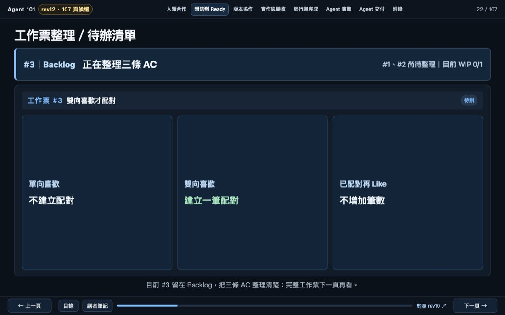 | #3 在 Backlog，三條 AC 情境能分別驗。完整票面在 P23。 |
| P41 | 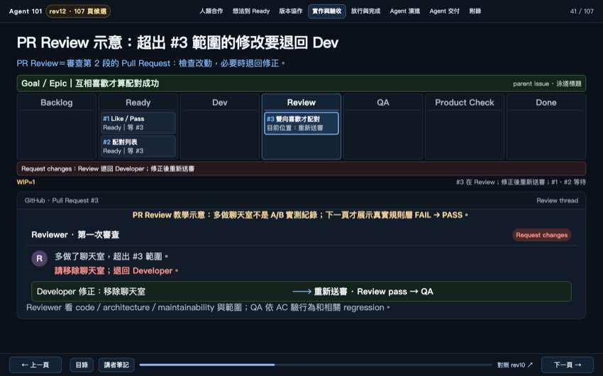 | 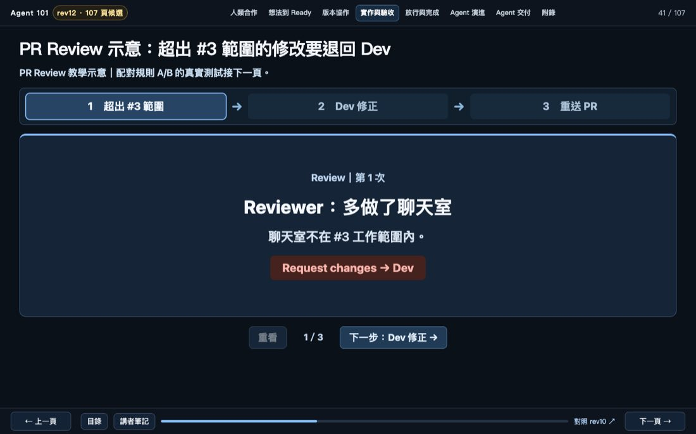 | 模擬 PR Review 按三步前進：發現超出範圍、Dev 修正、重送審查。 |
| P45 | 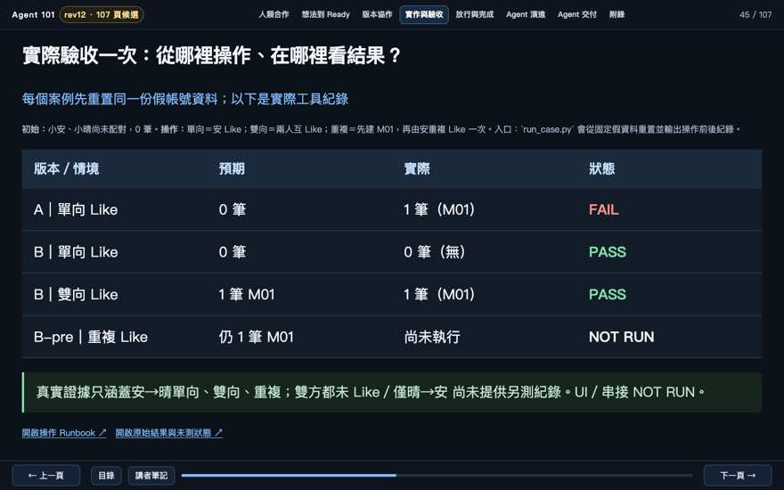 | 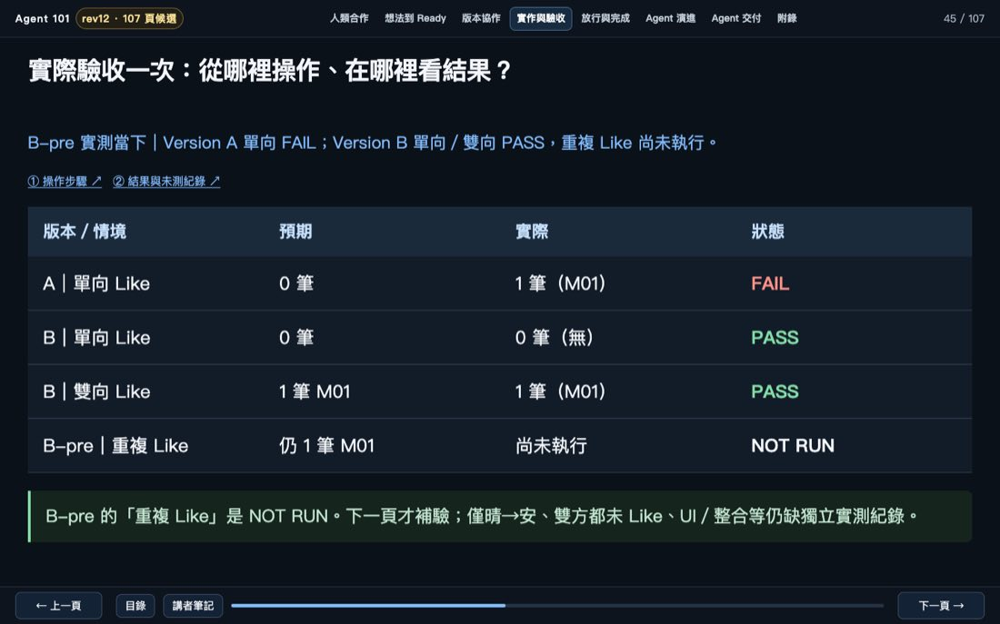 | B-pre 當下：A 單向 FAIL；B 單向／雙向 PASS；重複 Like 尚未執行。 |
| P46 | 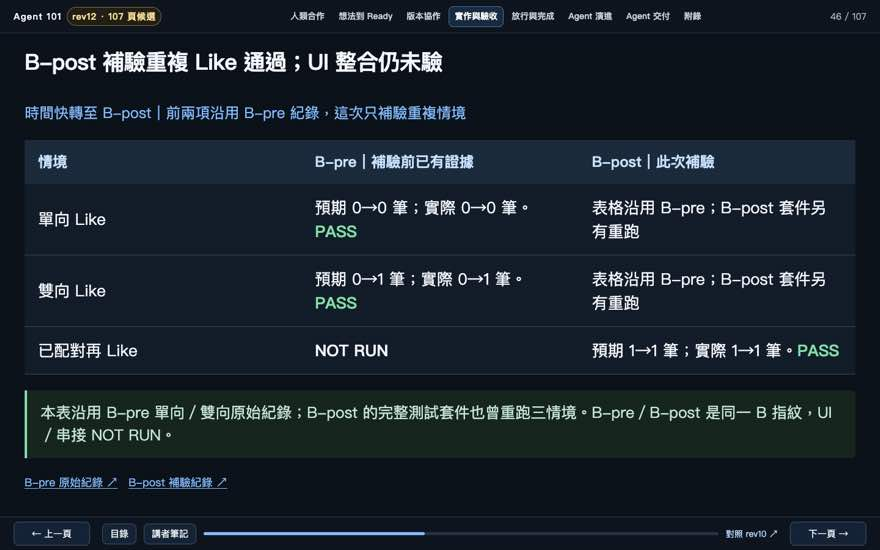 | 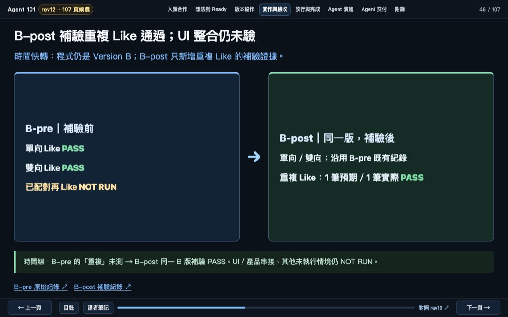 | 同一 B 版，B-pre → B-post 僅新增重複 Like 的補驗證據。 |
| P48 | 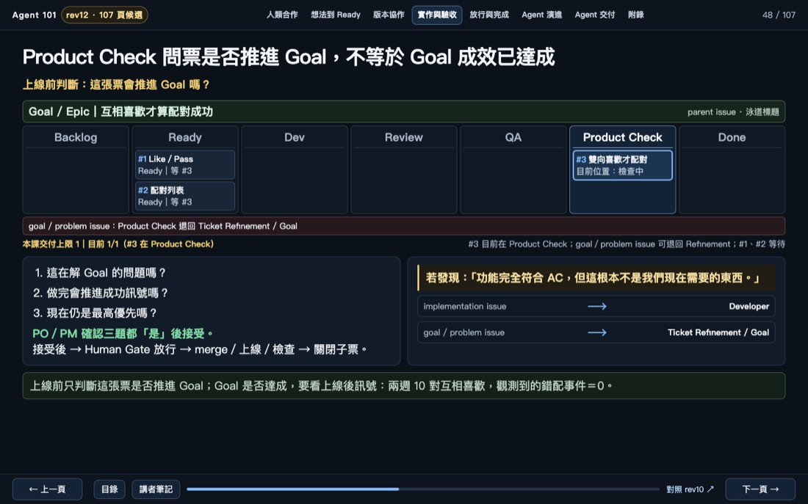 | 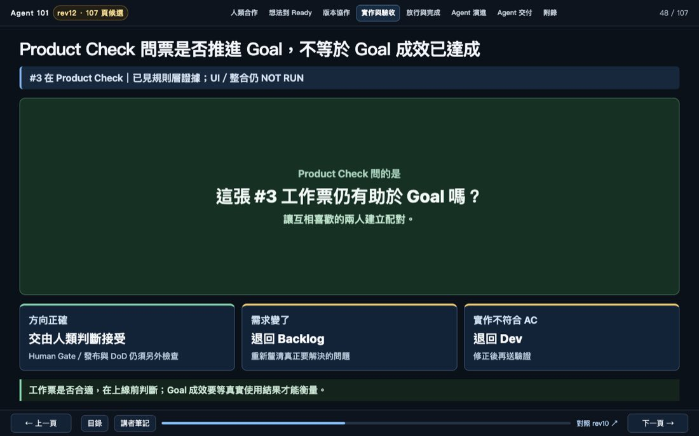 | Product Check 問工作票是否仍推進 Goal：可往人的接受、Backlog 或 Dev。 |
| P52 | 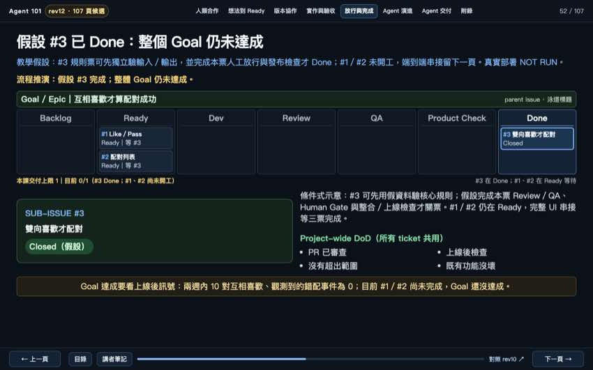 | 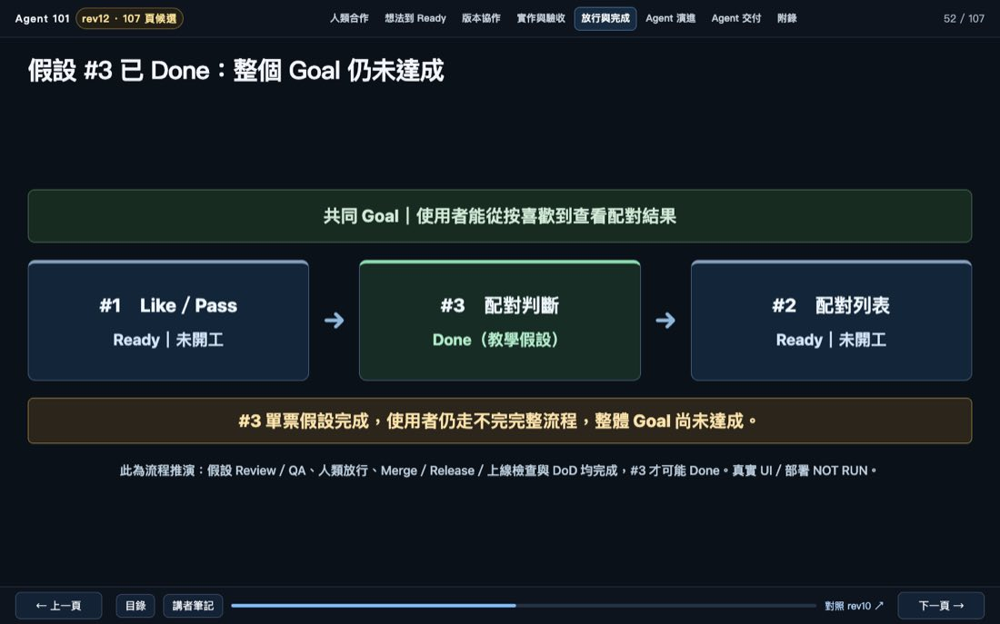 | 假設 #3 Done，#1／#2 尚未開工；完整使用者路徑還沒完成。 |
| P91 | 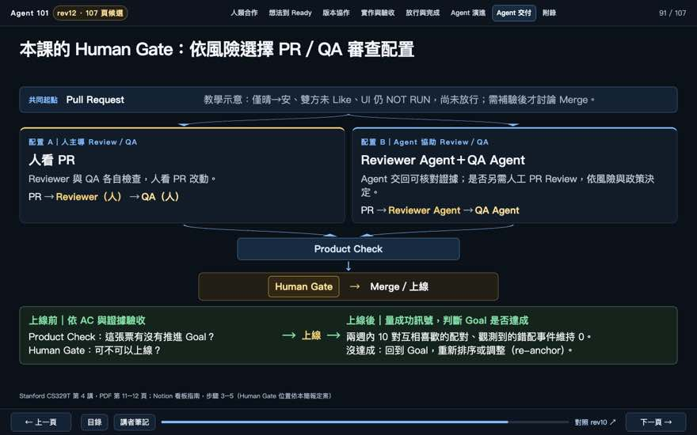 | 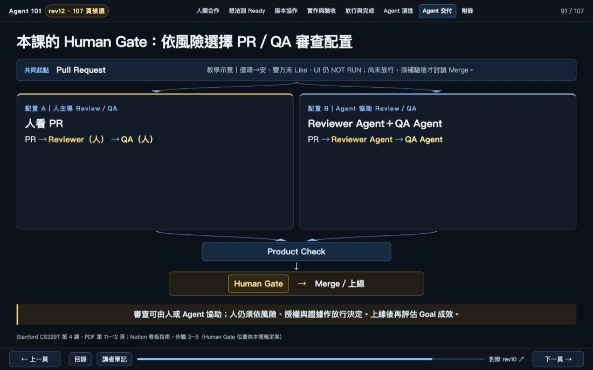 | 人或 Agent 參與 Review／QA，匯流到 Product Check；Human Gate 仍由人決定。 |
| P93 | 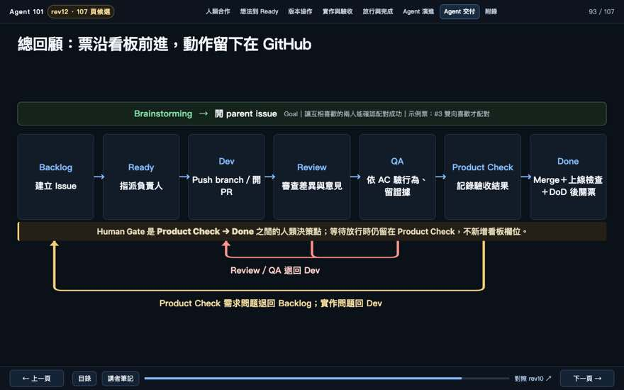 | 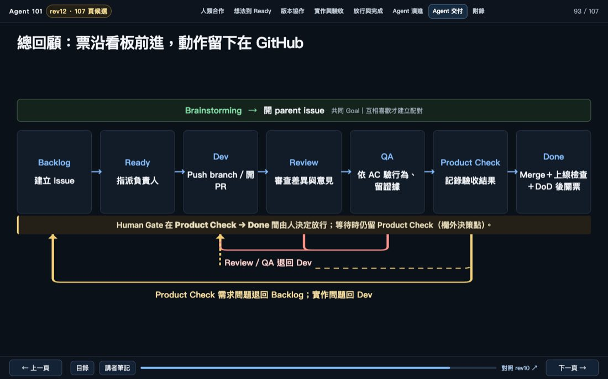 | 七欄看板，Product Check 可退 Backlog 或 Dev，Human Gate 是欄外決策。 |
| P95 | 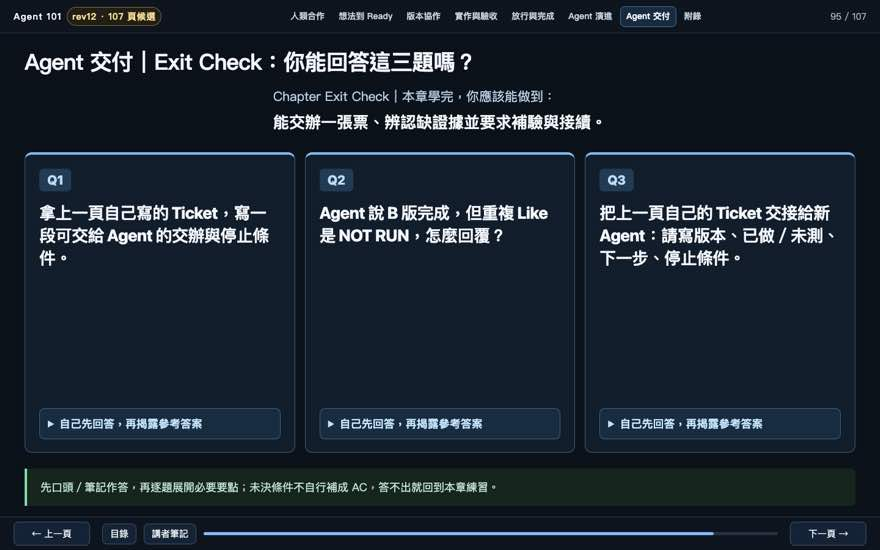 | 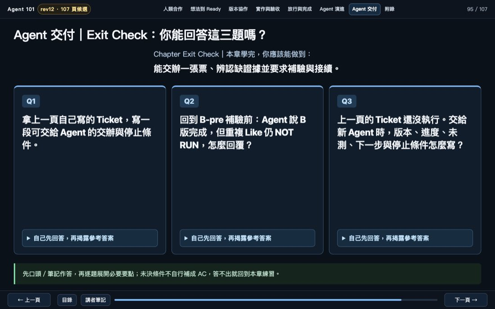 | 尚未執行的新 Ticket 能照實交接：無候選版本、尚無執行證據、全部未測。 |

## 證據與學習範圍

- P41 是 PR Review 的教學示意，不能冒充 Version A／B 的真實規則測試。
- P45、P46 區分 B-pre 與 B-post；B 版程式指紋相同。B-post 的整套重跑另有 Evidence，不混入這次補驗的主畫面。
- P48、P91、P93 保留 Product Check 與 Human Gate 的責任差異。規則層 PASS 不代表 UI 或部署完成。
- P52 的 Done 是條件式示意，真實部署與完整整合仍 NOT RUN。
- P95 新 Ticket 沒有實作歷史時，候選版本應填無、已做應標未執行、未測應列全部 AC。不得創造版本或測試結果。
- 此處是作者針對桌面 1440×900 畫面的 G4 核對與修正前後截圖。真人零基礎試教、實體投影硬體仍 NOT RUN。

## 每輪 G4 人工檢查

1. 觀眾看 5 秒，是否知道本頁教什麼、應先看哪一區？
2. 一張頁面有沒有同時放工作流程、完整工作票、兩個時間點及長篇補充？
3. 箭頭有沒有明確表達交接、退回與先後？卡片是否只是把文件換成不同底色？
4. 每個 PASS／FAIL／NOT RUN 與教學假設能否辨讀？
5. 有分步按鈕的頁面有沒有測完每階段、重看操作與鍵盤？
6. 改完是否實際看最新 HEAD 的截圖？瀏覽器 0 errors、0 overflow 不代表閱讀負擔合格。
7. 是否檢查受影響的前後頁？P22→P23、P41→P42–47、P48→P49–53、P91→P93／P95。

標題長度另輪統一審查，本輪保留既有標題。改版頁數依教學需要決定，不進行固定張數的交換。

## 修後核對

- 完整 107 頁的 CSS／HTML／JS 已重建；本次修改不影響 A01 Outline，也沒有刪除 rev11 原始 82 頁。
- 獨立唯讀的 AI 學員審查：指定範圍 P15、P21–P23、P40–P53、P87–P95 未發現 P0／P1。它讀取 HTML、hidden 屬性與 SVG 結構，沒有執行真實瀏覽器操作。
- 獨立唯讀的 AI 投影片設計審查：修改後的 P22、P41、P45、P46、P48、P52、P91、P93、P95 截圖沒有新增 P0／P1。後續指出 P22 空白看板、P45 操作入口位置、P93 路線註解與 P95 時間點的 P2，已依次處理。
- P22 在第二輪改成工作票狀態短條與三個驗收結果，省去佔位的空看板。P93 曾嘗試把路線文字疊到 SVG 上，畫面發生交疊，已撤回該文字標籤；保留黃實線到 Backlog、黃虛線到 Dev，以及下方退回原因說明。
- 現有截圖是本機修完後的最新畫面。正式真人視覺試教與實體投影硬體驗收仍 NOT RUN。
