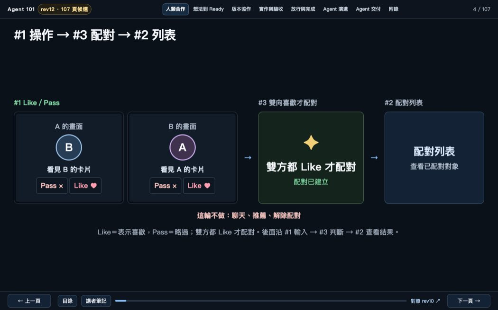
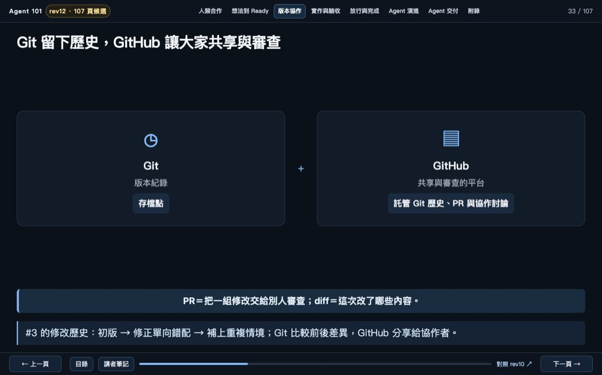
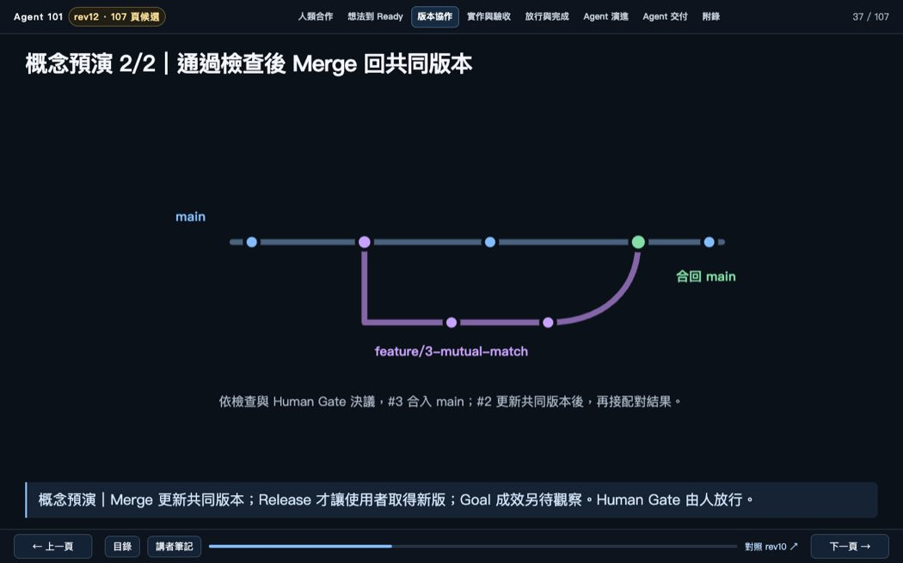
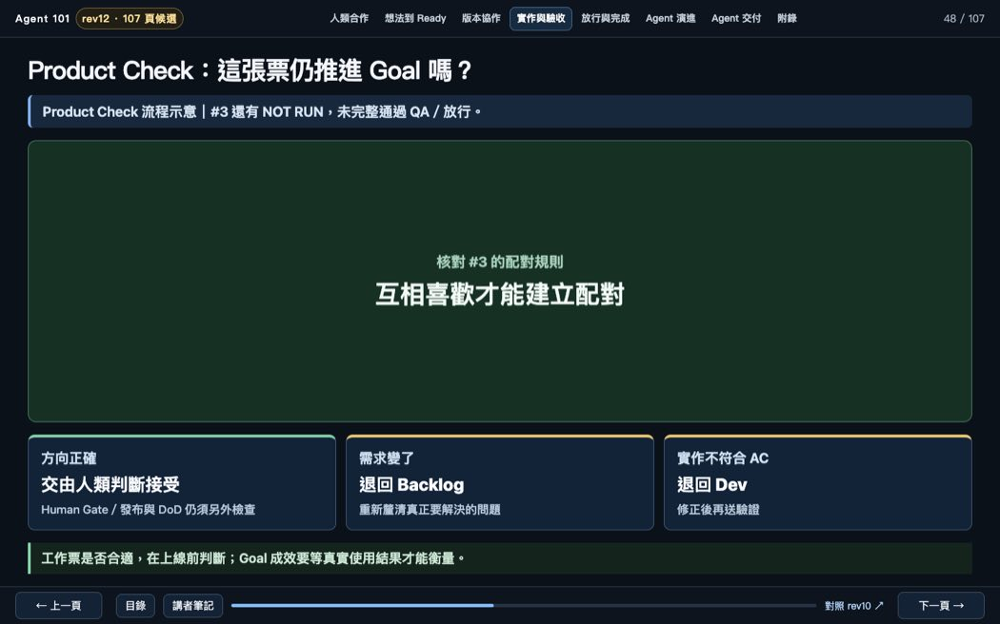
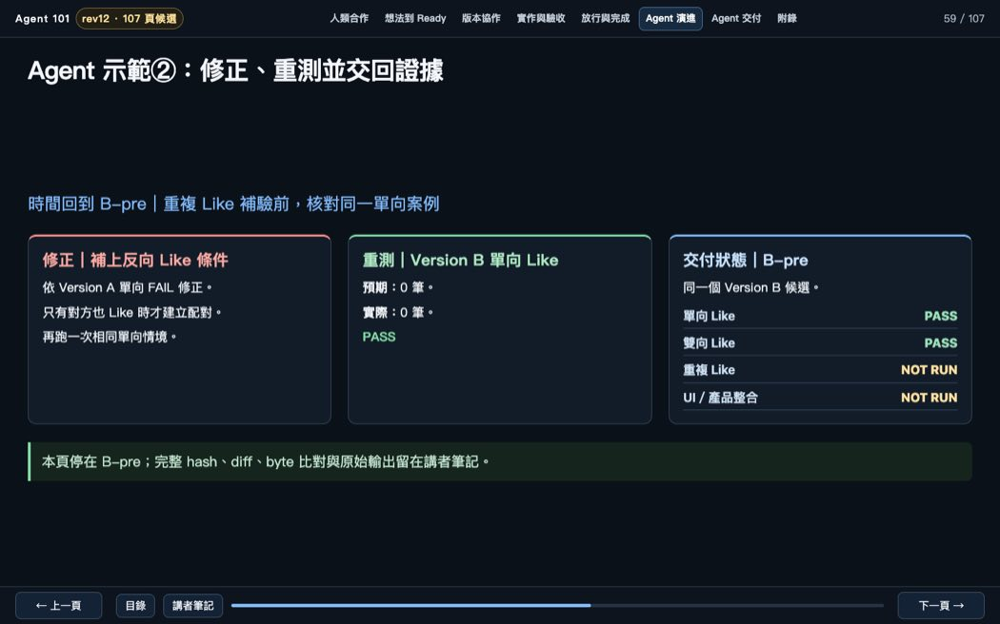
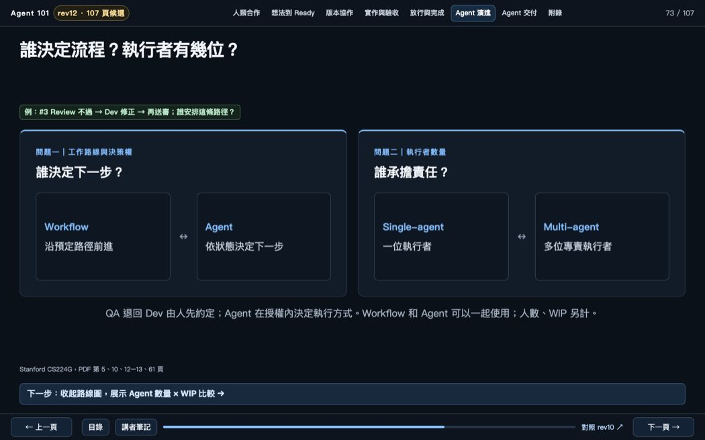
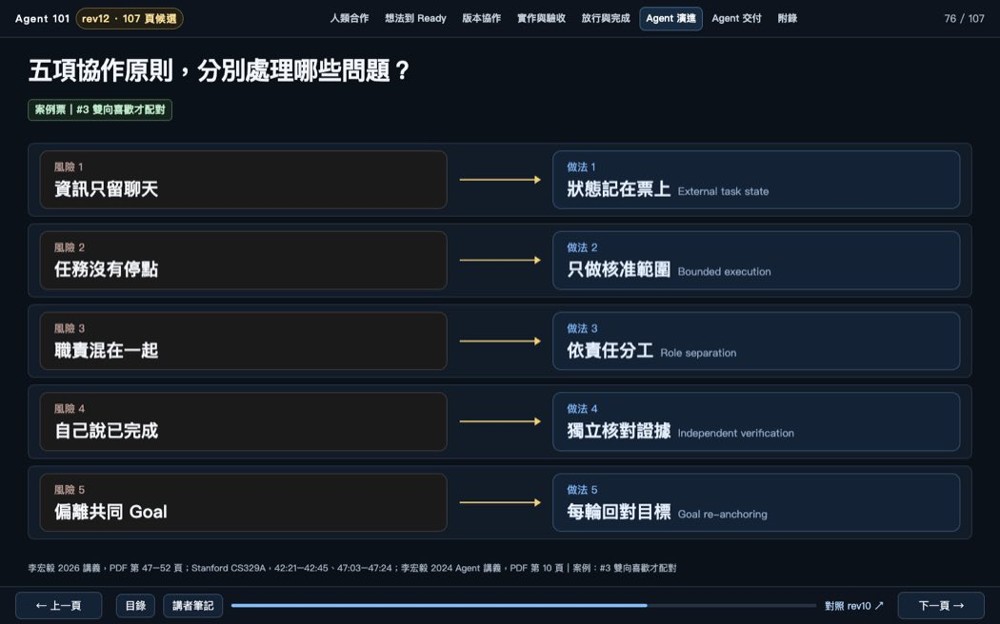
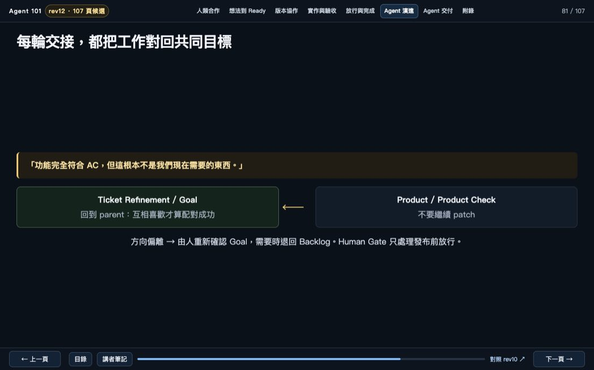
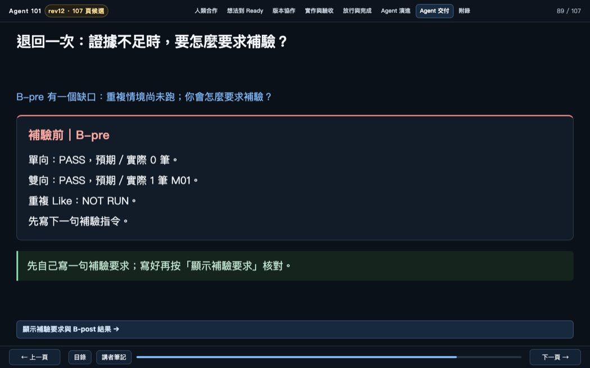
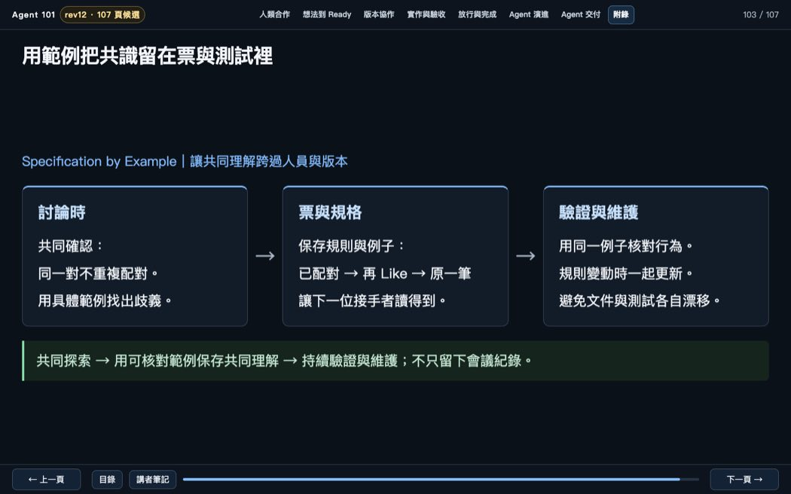

# Post-Demo 教材修訂與 G4／G5 紀錄｜2026-10-10

**基準：**Demo PR #49，HEAD 52bcdf6，已合併進 main（5eb43fe）。本輪使用獨立開發分支，未覆蓋展示中的 Demo。

## 開發／驗收分工

- Luna Max：本機 Codex CLI，gpt-6-luna，max effort，獨立 worktree；修正 19 張標題、P58–59 的 B-pre 示範，以及 P4／P41／P48／P91 標題與說明。
- ChatGPT：於正常 macOS 環境重播規則層 fixture、Chrome 107 頁與互動、實際桌面截圖；依獨立初學者審查發現再修正 P33–38、P48、P73–74、P81–82、P89–90 等缺口。Luna Max 後續遇到模型連線中斷，無法將那一輪算成開發驗收 PASS。
- Blind Beginner：另外的唯讀 AI 工作階段，依順序閱讀學員可見 107 頁，不先讀 README 或舊 Review；僅模型模擬，不代表真實學生試教。

## 修正項目

| 頁 | 教學改動 | 必須保留的事實 |
|---|---|---|
| P4 | #1 操作 → #3 配對 → #2 列表 | 票號和依賴順序一致 |
| P21／P40–41／P68–81／P85／P91／P93／P103／P105 | 精簡標題，問題與畫面對齊 | 問題頁可留問句，練習不預先揭露答案 |
| P58–59 | Agent 重演先看 Version A FAIL，再修正為 Version B；B-pre 明列已測／未測 | 重複 Like 在 B-pre NOT RUN，在同一 B artifact 的 B-post PASS |
| P33–37 | PR、diff 提前白話解釋；Merge、Release、Goal 成效分開 | P36–37 是概念預演，未實際發布 |
| P48 | Product Check 是流程示意；#3 還有 NOT RUN，QA 未完整通過 | 人類放行及發布不因規則層 PASS 自動完成 |
| P73／P74／P82 | Workflow 和 Agent 能一起運作；Agent 數量與 WIP 各自計算；#1 按鈕／#3 規則範圍分清 | QA→Dev 退回路徑由人先約定 |
| P81 | 人重新確認 Goal，必要時回 Backlog；箭頭指向 Goal | Human Gate 只處理發布前放行 |
| P89–90 | 先自己寫補驗要求，再揭露參考指令與 B-post 證據 | P89 起始答案隱藏；P90 Space／鍵盤可展開 |
| P30 | 教師作業明確標為遷移練習 | 不當成 Matching App 新需求 |
| P76 | 五項常見風險各配一個中文做法，英文僅作查閱標籤 | P77–81 承接細節 |

全部保留原 rev11 82 頁來源、107 頁正式教材、八章 Exit Check 共 24 題。新頁數是現況，無硬性上限。

## 實際測試與界線

- 107 頁 Storyboard／manifest／生成器標題一一對應：PASS。
- 教材契約 13／13，Matching 規則層單元測試 3／3，播放器回歸 6／6：PASS。
- Chrome 107 頁：0 JavaScript errors、0 geometry flags；8 張 Exit Check 能揭露答案；另外 14 項 P33／P36／P37／P48／P73／P74／P81／P82／P89／P90 互動與先備檢查 PASS。
- 真實 Matching A one-way FAIL；Version B one-way、two-way、duplicate PASS。只有規則層在實測範圍內。
- 真人零基礎學員試教、實體教室投影、真正 Matching UI／整合／產品發布：**NOT RUN**。手機版開發中。
- G3 獨立模型審查只檢查理解及文字；G4 由 ChatGPT 查看實際桌面截圖。兩者不能替代真人成效。

## 畫面紀錄（最新候選版）

| P4 | P33 | P37 | P48 | P59 |
|---|---|---|---|---|
|  |  |  |  |  |

| P73 | P76 | P81 | P89 | P103 |
|---|---|---|---|---|
|  |  |  |  |  |

Demo 版保留於 main；這輪修訂走新 PR，需經後續 Human Gate 決定是否發布。
