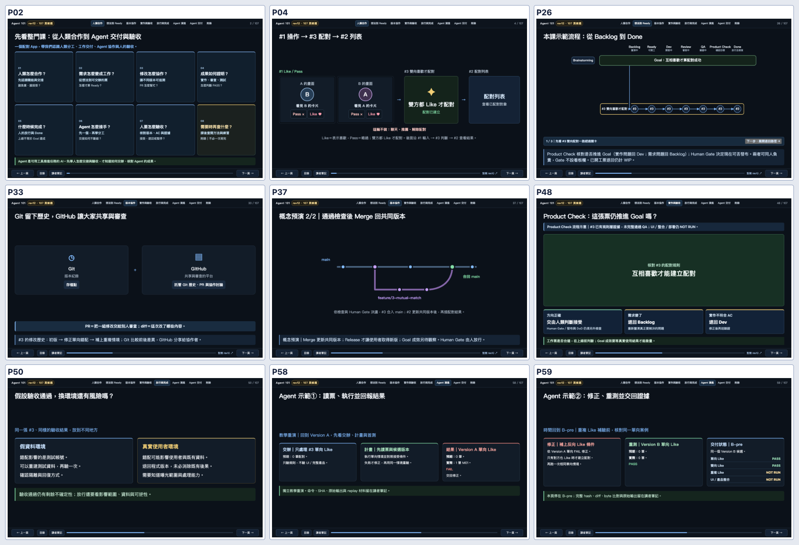
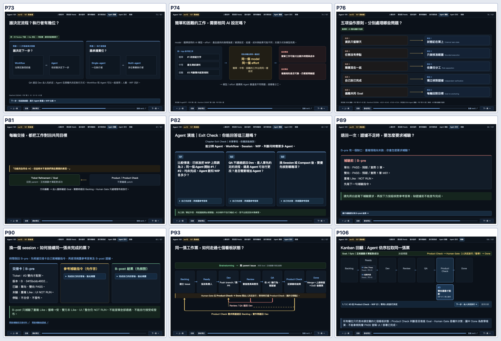

# Agent 101｜Post-Demo Luna Max／獨立驗收紀錄

**基準：** main 的 PR #49 Demo 版（合併 Commit 5eb43fe）；修訂分支 codex/postdemo-luna-ac-20261010。107 頁教材、原 rev11 82 頁基線、八張 Exit Check 都保留。

## 修改來源與協作邊界

- Luna Max 原開發分支：e75c624、ccc0df6。內容含 19 張標題調整、P58–59 Version A→B-pre、P4、P41、P48、P73–82、P89–90 的術語與教學修正。
- 另一開發分支：71bd9b9、221e9a8。強化練習揭露、B-pre/B-post 未測界線，以及部分 Title–Content Alignment。
- 整合建立在已合併 Demo 的 main 上，保留兩組歷史。Luna Max CLI 經兩次嘗試，已完成部分產生器來源衝突；其後出現模型連線／內部 collab 錯誤。本次剩餘 Git 來源衝突與測試修正由 ChatGPT Reviewer 處理。不可將 CLI 失敗輪次記作 Luna Max 完整驗收。
- 衝突以 generator＋Storyboard 為 SSOT 解決，兩份 HTML 與 manifest 由 build 重新產生；P50 使用「假設驗收通過，換環境還有風險嗎？」並同步來源／畫面。
- 目前只在獨立開發分支；Demo main 不變。不執行自動 Merge 或發布。

## Issue Guide／README AC 核對

| 追蹤項目 | 本輪驗證 | 尚待工作 |
|---|---|---|
| #50 看板／Human Gate | P26、P48、P91、P93、P106 維持七個看板欄；Product Check 為核對工作票方向；Human Gate 是欄外人工決策 | 真人教學場景確認 |
| #51 標題與正文 | 107 張標題與 manifest 對應；P2 Whole Picture、P4 #1→#3→#2、P50 假設、P58/59 的時點標示已校準。文字層禁語掃描沒有發現違規 | P26 全貌圖資訊量較高，試教時觀察學員能否追上逐步揭露 |
| #52 八張 Exit Check | A18–A25 共八張，每張三題；HTML 的答案預設收合，依題自行揭露 | 真人作答與遷移能力 NOT RUN |
| #53 畫面／證據分層 | 工作票、命令與 SHA 的長篇原始資料保留 Evidence／Notes；P48 明示 QA 未完整通過與 UI／整合／部署 NOT RUN | 實體投影硬體測試 NOT RUN |
| #54 示範→練習→回饋 | P58 A 單向 FAIL → P59 B-pre 同一 B 版 PASS／duplicate NOT RUN；P89／P90 先答後揭露；P95 可填無候選版本的工作交接 | 真實非工程學員練習 NOT RUN |
| #55 G4/G5 | 107 頁 Chrome／演示互動驗證；兩份九頁總覽合計覆蓋 18 張受影響代表頁；獨立唯讀文字審查 | 真正教室投影與手機正式版 NOT RUN |

**Readiness 判斷：**工程與模型文字審查已驗證的範圍可進下一輪 PR Review。人類學習成效、實體投影、真實 UI／產品發布仍 NOT RUN，不能以工程 PASS 代替。

## 執行證據

- `python3 scripts/build_rev11.py`：生成 107 頁，rev11 82 頁 SHA-256 維持 539f43b427dfeea7533639535763ab0517ad2e9581a76ecbc2f2e18387139fea。
- `python3 tests/educational_contract_test.py`：13/13 PASS。
- `python3 tests/issue48_storyboard_test.py`：107 頁／來源映射／章節與 Exit Check 契約 PASS。
- `python3 -m unittest discover -s workshop/matching-demo/tests -v`：3/3 PASS。
- `python3 tests/deck_check.py`：播放器六項測試 PASS。
- `BROWSER_CHANNEL=chrome DECK_URL=http://127.0.0.1:4349/slides/ npm run check:rev12`：107 頁，0 JavaScript errors，0 幾何越界旗標，八張 Exit Check 揭露、看板切換及基本導覽通過。
- Matching 規則重演：Version A one-way 預期 0／實際 1 筆 M01，FAIL；Version B one-way 預期 0／實際 0 PASS、two-way 預期 1／實際 1 PASS、duplicate 預期 1／實際 1 PASS。B-pre 時重複 Like NOT RUN；B-post 同一 B artifact 補驗才是 PASS。
- 原始 A SHA-256：ce09ee4c8091325bb40c71d7b5e74114af77b05be7457110a6274e5ea91e22b4。
- 原始 B SHA-256：0415bddc460265e1ef7c91fe96859b3a507cb345d2edd25ddccf6f061fbfc682。

## 最新桌面截圖抽查

[獨立唯讀初學者文字審查](independent-novice-review.md)：在實際閱讀的文字範圍內，沒有新 P0／P1；提出 P26 全貌圖較密集的 P2。該模型沒有執行 Chrome 或真人課堂，結果不可外推至硬體投影。

## 後續編輯決策

- P26 與 P93 是工作路徑／回顧圖，優先保留狀態、關聯及箭頭。若試教顯示觀眾追不上，請以逐步揭露或分頁處理，避免只縮字型。
- 新 Issue 若要增加 Outline、練習或解釋，可以合理增頁；頁數不要求一換一。
- 所有修改仍由獨立 Reviewer 依 G1–G5 對最新 HEAD 驗收；真正進 main 需另行 Human Gate 決定。
