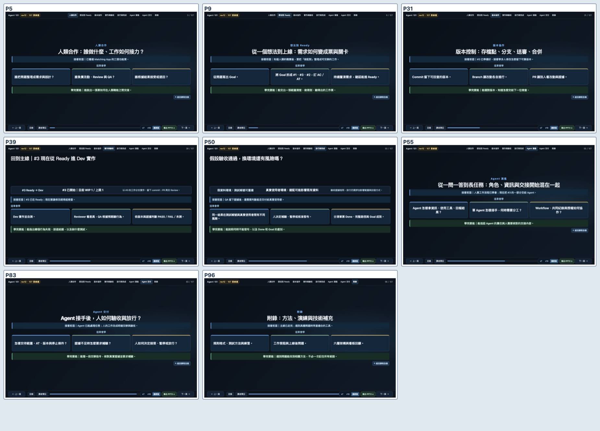
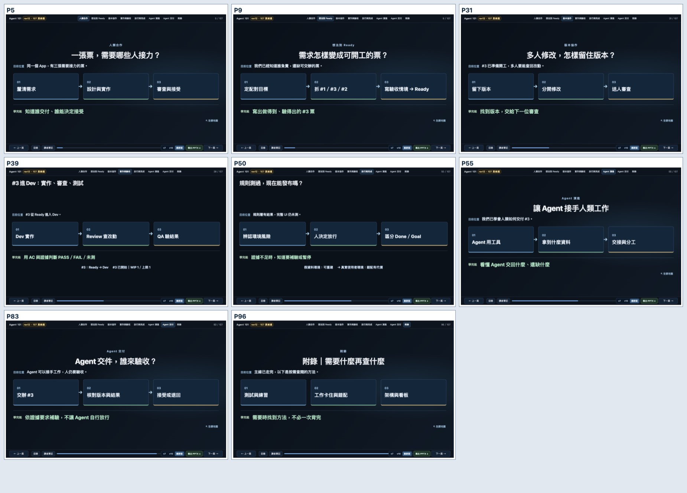
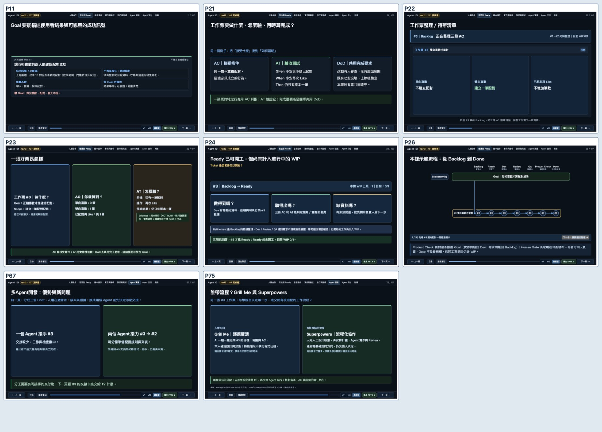
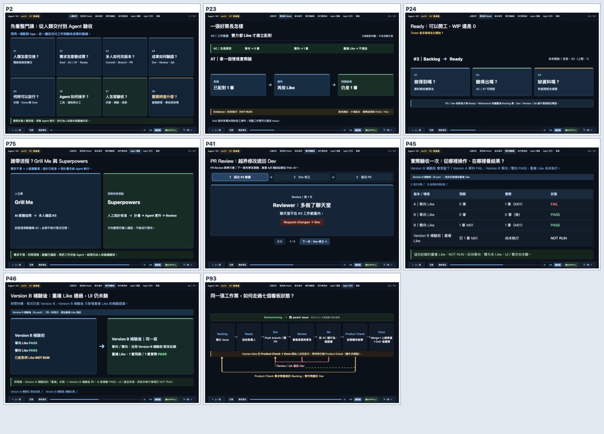

# PR #57｜單頁資訊設計重做（2026-10-10）

## 改動

依照最新 1440×900 桌面截圖，降低主畫面同時需要閱讀的資訊，保留教學例子與交付證據。

- P2 Whole Picture：八章保持原數量與連結，章名加一行用途；取消第三行重複說明。
- 八章 Overview（P5/9/31/39/50/55/83/96）：由長段落改成「前頁已知 → 本章三站 → 學完可做的事」。P39 的 WIP 與 P50 的實驗／真實環境提醒仍在。完整教學補充留 Storyboard/Notes。
- P23 好票：AC 列三種情境；AT 用「已配對一筆 → 再按 Like → 仍是一筆」展示前提、操作與預期結果。Evidence 尚未執行（NOT RUN）。
- P24 Ready：沿 Backlog → Ready 做三項檢查；缺資料時回票面繼續 Refinement。未開工，WIP 0/1。
- P75：Grill Me 為人逐題決策；Superpowers 須先人工設計核准，再安排計畫、Agent 實作與 Review。兩條路線都保留人的接受責任。

原 rev11 82 頁、A01–A25 二十五張內容及八張 Exit Check 保留。現有 107 頁是當前設計結果，頁數可以依教學需要調整。

## 前後截圖

**八章導入**

**Whole Picture、工作票、Ready、Agent 協作**

## 同頁文字量變化（僅供對照）

文字長度不作全課硬性及格線。流程圖與資料表要依實際可讀性判斷。

| 頁面 | 原可見字元 | 新可見字元 | 差異 |
|---|---:|---:|---:|
| P02 | 374 | 278 | -25.7% |
| P05 | 143 | 91 | -36.4% |
| P09 | 175 | 114 | -34.9% |
| P23 | 250 | 217 | -13.2% |
| P24 | 281 | 188 | -33.1% |
| P31 | 145 | 102 | -29.7% |
| P39 | 222 | 136 | -38.7% |
| P50 | 207 | 115 | -44.4% |
| P55 | 224 | 117 | -47.8% |
| P75 | 361 | 226 | -37.4% |
| P83 | 161 | 110 | -31.7% |
| P96 | 179 | 96 | -46.4% |

## 獨立唯讀視覺複查

[AI 投影片視覺審查](independent-ai-visual-review.md) 看了修改前後的 P2、八章 Overview、P23、P24、P75。未見有具體截圖支持的 P0／P1。P2 八張索引卡權重接近、P24 Ready 決策者不夠明確、P75 適用條件放在品牌後面，列為 P2 建議。

依此修改：P2 在不強制分四段的情況下用色彩分辨 Agent 學習段；P24 加 PO／Dev 核對後再移 Ready；P75 將「需求不清／設計已核准」放在兩條路線之前。Chrome 已重新截圖。真人試教、現場投影仍 NOT RUN。

## 研究依據與 G4 檢查

- Mayer 與 Fiorella：Coherence、Signaling、Segmenting 支持排除無關資訊、引導注意力、把複雜訊息分段。 https://www.cambridge.org/core/books/abs/cambridge-handbook-of-multimedia-learning/principles-for-managing-essential-processing-in-multimedia-learning/A9E77D0172F905AC957689D1771E2888
- Garner & Alley（2013）：Assertion–Evidence 版型將簡報主張連到可見證據。 https://pure.psu.edu/en/publications/how-the-design-of-presentation-slides-affects-audience-comprehens/
- University of Waterloo：投影片應呈現主觀點，避免把逐字講稿放在畫面。 https://uwaterloo.ca/centre-for-teaching-excellence/catalogs/tip-sheets/designing-visual-aids

每輪 G4 目視檢查：主焦點、五秒掃讀、箭頭是否真的代表順序、能否把解釋留 Notes、是否保留 PASS／FAIL／NOT RUN 和人的核准限制。

新增 tests/visual_storytelling_contract_test.py 防止這些頁恢復文字牆、AT 失去具體操作、Ready 回到完整七欄畫面，或 Superpowers 被講成自動發布。

真人非工程背景學員試教、現場投影距離與 Matching App UI／整合／部署仍 NOT RUN。
