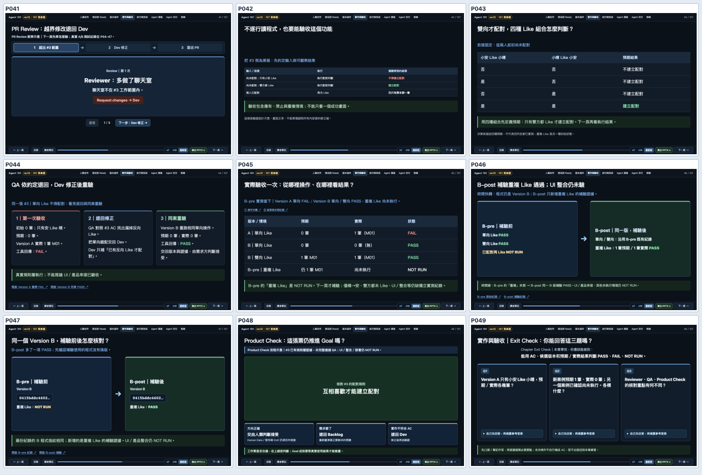
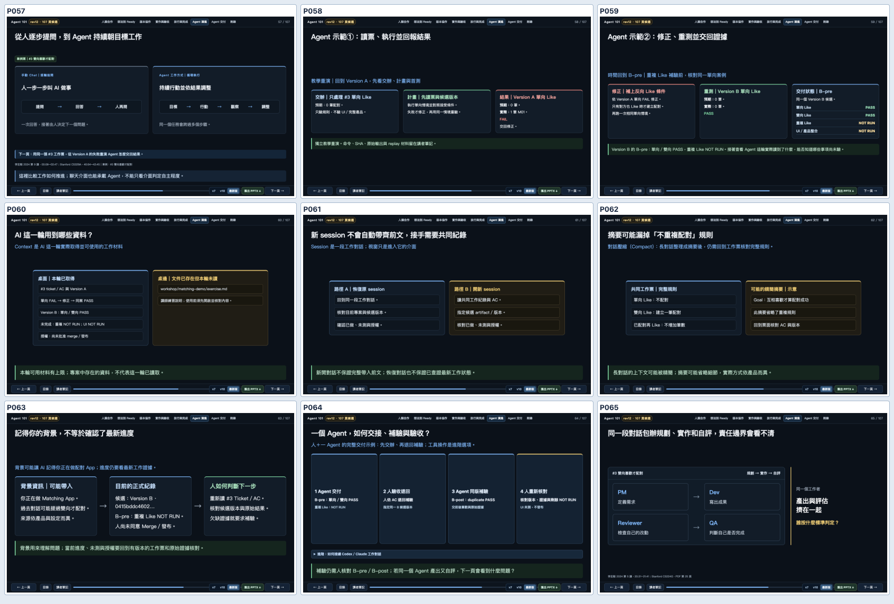
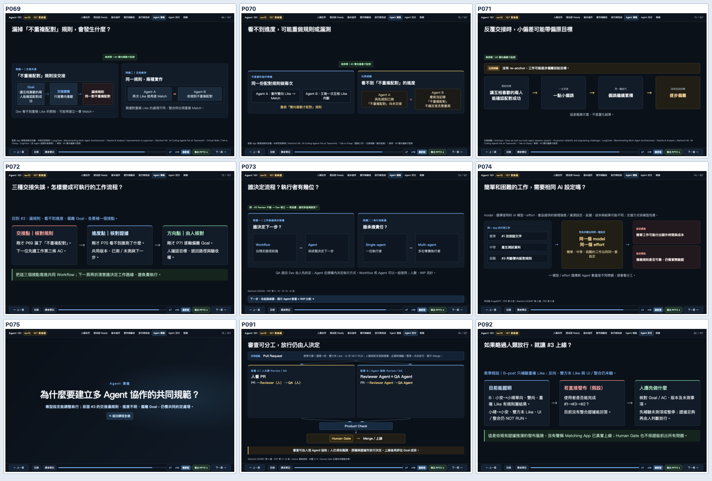
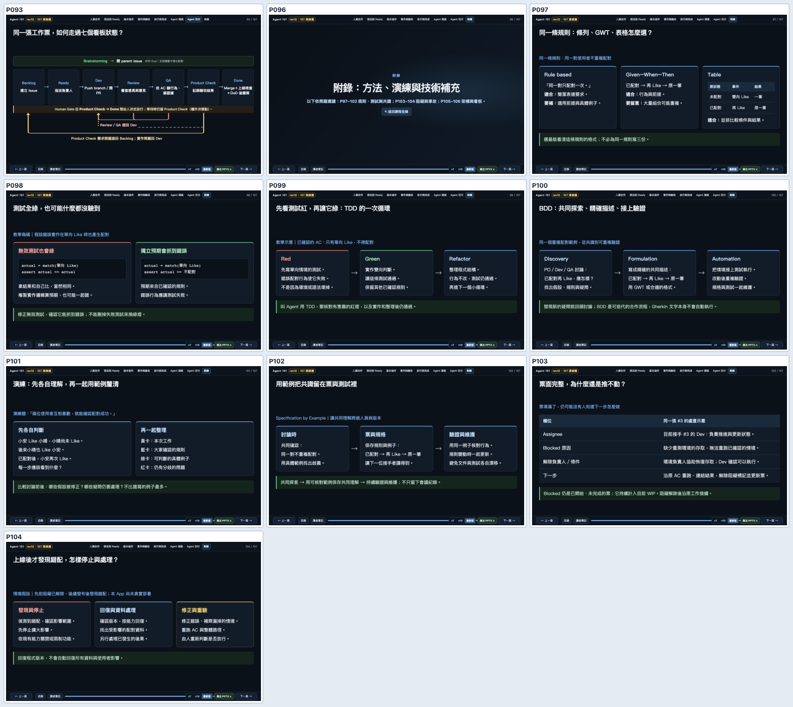

# PR #57｜跨頁敘事與資訊增益修訂

**日期：**2026-10-10。以 PR #57 的 5b4dc0a 為基準，修正後版本仍保留原 rev11 的 82 頁與 A01–A25 25 頁，共 107 頁。107 頁並非上限，未做一換一。

## 評估方法

讀完一頁後，要能回答「帶走什麼資訊」；下一頁要使用這份資訊作新判斷。如果先看見結論才教方法、重述剛才的測試結果卻沒教新技能、換 unrelated 案例再換回來，就視為敘事缺口。僅在時間重演、場景改變與教學章節切換提供明確提示，不替每張投影片加導遊語句。

參考：
- Carnegie Mellon Eberly Center｜Plan Your Course Content and Schedule：https://www.cmu.edu/teaching/designteach/design/contentschedule.html
- Mayer & Fiorella｜Segmenting / Pre-training：https://www.cambridge.org/core/books/abs/cambridge-handbook-of-multimedia-learning/principles-for-managing-essential-processing-in-multimedia-learning/A9E77D0172F905AC957689D1771E2888
- Mayer & Fiorella｜Coherence / Signaling：https://www.cambridge.org/core/books/abs/cambridge-handbook-of-multimedia-learning/principles-for-reducing-extraneous-processing-in-multimedia-learning/F29A19FCD34C542806F736E0661C05F5

## 主要修訂與實際增益

| 頁面 | 修改原因 | 修正後的認知順序 |
|---|---|---|
| P41–47 | 原本 QA 錯誤與修正結果出現在黑箱測試方法之前；B-post 後又重播 Version A | PR Review 範圍 → P42 黑箱輸入／可觀察結果 → P43 Like 條件預期 → P44 QA 真實退回 A FAIL／B PASS → P45 B-pre 已測／未測 → P46 B-post 補驗 → P47 同一 Version B SHA 確認。歷史頁面素材仍在原 Git／oldRev11 mapping。 |
| P57–65 | Agent 示範已重複前段 A/B；Context、Session、摘要、背景像數個平行概念 | P57 明示用同一張 #3 的 Version A 做教學重演 → P59 B-pre → P60 Agent 本輪有什麼材料 → P61 如何接續對話 → P62 摘要可能漏 AC → P63 背景與有版本的工作證據之差 → P64 人退回同一 B 版補驗 → P65 為何同一角色自評有風險。 |
| P69–75 | P69–71 三個警告並列；P72 突然換廚房比喻，P73 再回 Agent | P72 沿同一 Matching #3，把漏規則、看不到進度、偏離 Goal 轉為核對 AC／更新工作紀錄／人核對方向三站，再接 P73 的 Workflow／Agent 與 WIP。舊廚房圖仍可追歷史原稿，未刪 Git 歷史。 |
| P91–93 | 人類 Gate 後突然切到教材發布事件，再返回看板 | P92 改沿 Matching #3 的 B-post 規則證據：UI／整合 NOT RUN。僅「若跳過 Gate 發布」的教學假設，接 P93 七欄回顧。教材真實發布事件保留於 P92 speaker notes 的歷史背景。 |
| P97–104 | Example Mapping 演練後突然接 Blocked，再倒回可核對規格 | P101 演練 → P102 用 Specification by Example 保存共識 → P103 Blocked、執行條件／責任 → P104 上線後事故處理；P96 將附錄分成選讀段落。 |

## 最新畫面及跨頁證據

[全 107 頁「前頁已知／本頁新增／下一頁問題」矩陣](page-to-page-map.md)

## 獨立複查：發現與修復

- [Luna Max 修改前的跨頁審查](luna-before-fix-review.md) 指出 P42 方法落在實測後、P72 突然改廚房、P92 換教材事故等問題，本次已沿同一 Matching App 修正。
- [修正後第一輪文字複查](luna-after-first-pass.md) 找到兩處新 P1：P41 預告「真實測試接下一頁」，而實際 P42 是教 QA 驗收方法；P91 把補驗寫成放行前絕對必要，P92 又列出未完整驗證的放行選項。
- 依複查修正 P41、P43、P91、P92，對實測方向、未測組合及 Human Gate 做精確說明；P104 額外標出是「假設阻礙解除且後續發布」的事故情境。
- [第二輪限縮複查](luna-final-spotcheck.md) 針對 P41–44、P91–92、P103–104 的**最新實際 HTML 文字**確認：指定範圍沒有 P0/P1，未做真人試教／實體投影；該模型沒有替作者按下任何放行操作。

## AC 與驗收限制

- 由最新 Storyboard 重新建構 HTML、manifest，來源頁的映射不遺失；P42–44 與 P102–103 允許內容換序。
- 新增跨頁敘事契約測試：全部 107 頁、七種特定學習鏈、Exit Check 答案預設隱藏、Human Gate 與 B-pre／B-post 範圍。
- Chrome 需要 107 頁 0 JavaScript errors、0 geometry overflow，並以最新四組連續頁截圖查看版面。只看測試數字不可宣稱資訊增益已被真人證實。
- PPTX 需重新匯出最新版，確保網頁與離線檔相同；v7 和 v10 保留不變。
- 作者與獨立 AI Reviewer 分開，獨立審查需對照實際 HTML。真人零基礎學員教學、投影現場、Matching UI／產品部署仍 NOT RUN。
- 標題字數全面調整、真人試教卡點與硬體投影仍留後續 Human Gate；本輪以資訊順序與教學證據為主。
