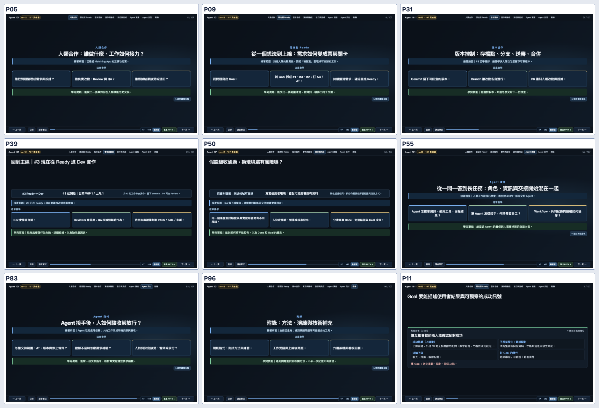
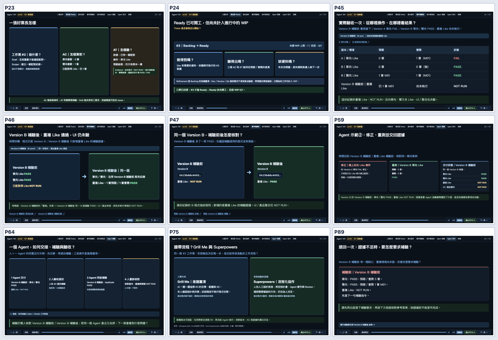
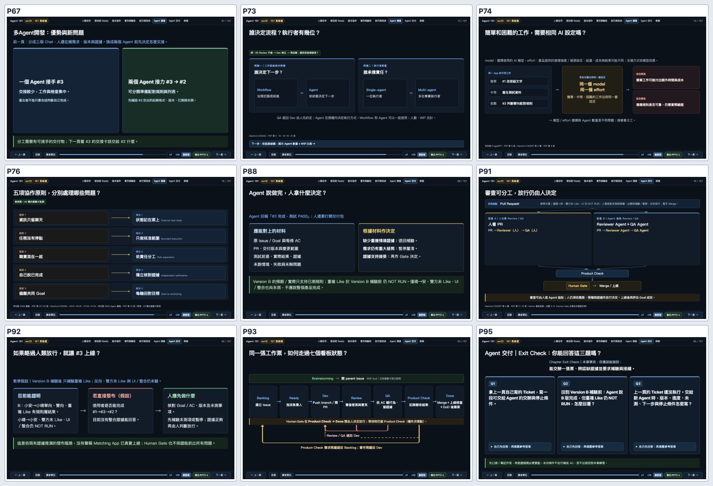

# PR #57｜初學者章節導入、AT、Refinement、Agent 協作（2026-10-10）

## 修改內容與頁面

| 頁面 | 已修正 | 學員能帶走什麼 |
|---|---|---|
| P5／9／31／39／50／55／83／96 | 八章加入「前面學了什麼、這章三件事、學完能做什麼」。P39 保留 #3 Ready→Dev、WIP 1/1；P50 保留測試資料與真實資料風險。 | 不用一進章節就背新名詞。 |
| P11 | 移除「護欄訊號」與尚無觀測卻聲稱錯配為 0 的寫法。改為「不希望發生：錯誤配對」，說明須有監測或回報資料。 | 分清成功目標、可能風險與實際觀測。 |
| P21–24 | P23 的長篇票面改成三張卡：做什麼／AC 怎樣算對／AT 怎樣驗。AT 使用「已配對→再次 Like→仍一筆」，執行前 Evidence 為尚未執行（NOT RUN）。P24 用 Ready 三問取代重複看板；七欄路線保留在 P26、P93。 | AT 是可執行、可核對的情境；執行後才有真正結果。 |
| P24／26／93 | Refinement 是持續釐清 Backlog 的工作；Dev、Review、QA 遇需求不清、做不到、驗不出來時，帶問題回票面確認。 | 不新增看板欄位，工作需要時可以重新釐清。 |
| P45–47、P58–64、P88–90 | 將 B-pre／B-post 換成學員看得懂的「Version B 補驗前／補驗後」，第一次提及附上原始 Evidence 的技術代號。路徑、hash、原始 JSON 不變。 | 同一 B 版程式，新增了重複 Like 測試證據；UI／整合仍未測。 |
| P56／60 | 直接區分 Agent（使用工具推進任務的 AI）與 Context（這一輪已取得的資料）。 | 執行任務與使用哪些資料是兩個概念。 |
| P67 | 將原本純標題的「多 Agent」分隔頁改成一 Agent／兩 Agent 分工比較，接到下一頁 #3→#2 的交接卡。 | 分工前應先約定格式、版本、已測與未測。 |
| P75–76 | 原分隔頁改成 Grill Me 人主導逐題釐清 vs Superpowers 有人工設計核准的工作流程；五項協作做法保留下一頁。 | 兩種協作模式都有人作取捨與驗收。 |

107 頁、原 rev11 82 頁來源與 A01–A25 25 張新增內容完整保留。頁數不是上限，不做一換一。本輪將原本沒有資訊增益的子段落封面變成可以比較和作判斷的頁面。

## 使用的原始資料

- [Agile Alliance Acceptance Testing](https://agilealliance.org/glossary/acceptance-testing/)：以可核對的行為或使用情境表示接受測試。
- [Scrum.org Product Backlog Refinement](https://www.scrum.org/resources/product-backlog-refinement)：Refinement 是持續細化工作票的活動，未規定獨立看板欄位。
- [Grill Me](https://github.com/stevegsax/grill-me)：人主導問答、澄清設計，訪談本身不實作程式。
- [Superpowers](https://github.com/obra/superpowers) 與 [Brainstorming skill](https://github.com/obra/superpowers/blob/main/skills/brainstorming/SKILL.md)：設計需人工核准，流程包含規劃、執行、Review。
- [OpenAI Agents SDK: Agents](https://openai.github.io/openai-agents-python/agents/) 與 [Context](https://openai.github.io/openai-agents-python/context/)：執行者配置／工具與本輪資料是不同概念。

## G1、G4、G5 驗收

- Luna Max 原開發執行完成六項新 AC 測試草稿，後因模型狀態停住。後續來源編輯、SSOT、CSS 與回歸由 ChatGPT 繼續；不能把未完成的 Luna Max 回合算成 PASS。
- 教材契約 19／19 PASS；跨頁敘事 7／7 PASS；故事板 107 頁來源映射與原 rev11 82 頁 baseline PASS。
- 107 頁獨立靜態合約檢查：八章 Overview、AC／AT、Refinement、Goal 用語、Agent／Context、版本補驗：0 blocking、0 warning。
- Chrome 107 頁：0 JS errors、0 geometry overflow。播放器六項回歸、Matching 三項測試均保留與執行。
- V7／V10 為原 44／55 頁；目前 107 頁 PPTX 從本輪最新 HTML 重新匯出，逐張 PPTX 圖片與備忘稿經檢查。
- 獨立唯讀 AI 小白文字審查核對 P1–107 及本輪修改頁，沒有提出 P0／P1；括號技術代號、P89–90 重複寫法仍是可編輯 P2，不等於經過真人試教。
- P67 新分工頁由 Reviewer 直接檢查最新 1440×900 截圖；P23／P24 也在密度檢討後再次縮減為可掃讀三卡。

## 圖像

## 尚未執行

- 真人零基礎學員的理解、實際答題與實體投影距離測試：NOT RUN。
- 真實 Matching App UI、整合、部署：NOT RUN。
- PPTX 是保留畫面排版的圖片版；互動題目的逐步揭露請使用網頁版。
- Draft PR #57 尚未獲 Owner 放行，不自行 Merge main。
